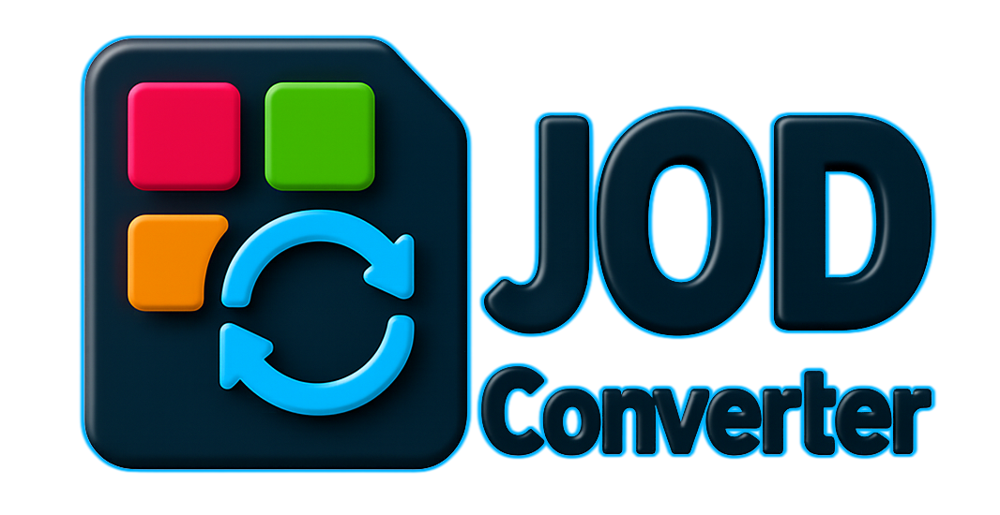

[](https://github.com/jodconverter/jodconverter/actions/workflows/build.yml)
[](https://coveralls.io/github/jodconverter/jodconverter?branch=master)
[](https://www.codacy.com/gh/jodconverter/jodconverter/dashboard?utm_source=github.com&utm_medium=referral&utm_content=jodconverter/jodconverter&utm_campaign=Badge_Grade)
[](https://opensource.org/licenses/Apache-2.0)
[](https://central.sonatype.com/artifact/org.jodconverter/jodconverter-local)
[](https://javadoc.io/doc/org.jodconverter/jodconverter-local)
[](https://gitter.im/jodconverter/Lobby?utm_source=badge&utm_medium=badge&utm_campaign=pr-badge&utm_content=badge)
[](https://github.com/sponsors/jodconverter)
[](https://www.paypal.com/cgi-bin/webscr?cmd=_s-xclick&hosted_button_id=XUYFM5NLLK628)
[](https://www.buymeacoffee.com/sbraconnier)

<p align="center">
  
</p>

**JODConverter**, the Java OpenDocument Converter, converts documents between office formats: Word, Excel, PowerPoint, OpenDocument, PDF, HTML, images and many more. It drives a [LibreOffice](https://www.libreoffice.org) or [Apache OpenOffice](https://www.openoffice.org) installation, so it converts whatever that office converts.

It can be used:

- as a **Java library**, in your own application;
- with **Spring Boot**, through a starter that configures everything;
- as a **command line tool**, in your scripts.

📖 **[Documentation](https://jodconverter.github.io/jodconverter/latest/)** · [Release notes](https://jodconverter.github.io/jodconverter/latest/release-notes/) · [FAQ](https://jodconverter.github.io/jodconverter/latest/faq/) · [Samples](https://jodconverter.github.io/jodconverter/latest/samples/)

## Requirements

- Java 17 or later.
- [LibreOffice](https://www.libreoffice.org) (recommended) or [Apache OpenOffice](https://www.openoffice.org), installed on the machine that converts.

| JODConverter | Java | Spring Boot |
| ------------ | ---- | ----------- |
| 5.x          | 17+  | 4.x         |
| 4.4.x        | 8+   | 2.x and 3.x |

Coming from 4.4? See the [migration guide](https://jodconverter.github.io/jodconverter/latest/migration-guides/migration-guide-5.0.0/).

## Quick start

Add the library, here for LibreOffice (see the [modules](https://jodconverter.github.io/jodconverter/latest/getting-started/modules/) for the other ones):

```xml
<dependency>
    <groupId>org.jodconverter</groupId>
    <artifactId>jodconverter-local-lo</artifactId>
    <version>5.0.1</version>
</dependency>
```

```kotlin
implementation("org.jodconverter:jodconverter-local-lo:5.0.1")
```

Then start an office manager once, and convert:

```java
import java.io.File;

import org.jodconverter.core.office.OfficeUtils;
import org.jodconverter.local.JodConverter;
import org.jodconverter.local.office.LocalOfficeManager;

public class Example {

  public static void main(String[] args) throws Exception {
    // Starts an office process, found in its default location, and keeps it for all the conversions.
    LocalOfficeManager officeManager = LocalOfficeManager.install();
    try {
      officeManager.start();

      // The formats are those of the file extensions.
      JodConverter.convert(new File("document.docx")).to(new File("document.pdf")).execute();
    } finally {
      OfficeUtils.stopQuietly(officeManager);
    }
  }
}
```

An office manager is meant to live as long as the application, and to be shared by all its conversions: starting an office process costs much more than a conversion.

### With Spring Boot

Add the starter next to the library:

```kotlin
implementation("org.jodconverter:jodconverter-spring-boot-starter:5.0.1")
implementation("org.jodconverter:jodconverter-local-lo:5.0.1")
```

enable it:

```properties
jodconverter.local.enabled=true
```

and inject the converter where you need it:

```java
@Service
public class ReportService {

  private final DocumentConverter converter;

  public ReportService(DocumentConverter converter) {
    this.converter = converter;
  }

  public void toPdf(File source, File target) throws OfficeException {
    converter.convert(source).to(target).execute();
  }
}
```

### From the command line

Download `jodconverter-cli` from the [latest release](https://github.com/jodconverter/jodconverter/releases/latest), unpack it, then:

```shell
bin/jodconverter-cli document.docx document.pdf
```

(`bin\jodconverter-cli.bat` on Windows.)

## Going further

- [PDF options](https://jodconverter.github.io/jodconverter/latest/getting-started/pdf-options/): PDF/A, PDF/UA, passwords, watermark, signature.
- [Supported formats](https://jodconverter.github.io/jodconverter/latest/getting-started/supported-formats/) and [configuration](https://jodconverter.github.io/jodconverter/latest/configuration/) of the office managers.
- [Running in containers](https://jodconverter.github.io/jodconverter/latest/getting-started/containers/), and converting through a [LibreOffice Online or Collabora Online](https://jodconverter.github.io/jodconverter/latest/getting-started/libreoffice-online/) server instead of a local office.

## Getting help and contributing

- Questions and discussions: the [Gitter room](https://gitter.im/jodconverter/Lobby). Bugs and feature requests: the [issues](https://github.com/jodconverter/jodconverter/issues), after a look at the [FAQ](https://jodconverter.github.io/jodconverter/latest/faq/).
- Contributions are welcome: see the [contributing guide](.github/CONTRIBUTING.md).
- To report a vulnerability, see the [security policy](.github/SECURITY.md).

## License

JODConverter is licensed under the [Apache License, Version 2.0](LICENSE).
